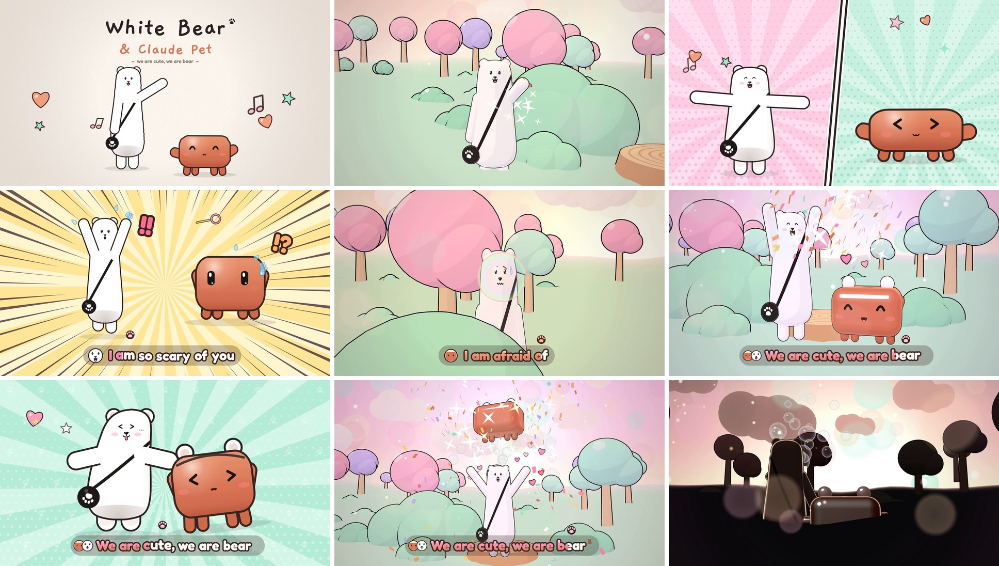

# White Bear & Claude Pet — *We Are Cute, We Are Bear*

A 78-second music video for the song in `assets/song.mp3`, starring **White Bear**
(from the character sheet: tall white bear, round ears, black crossbody strap
with a paw-print bag, pom-pom tail) and the **Claude Pet** (the orange Claude
critter, drawn smooth instead of pixelated). It mixes **2D hand-drawn animation**
and **3D toon-shaded animation**, with **karaoke lyrics** synced word by word.



## Watch it

| File | What it is |
|---|---|
| `output/white-bear-and-claude-pet.mp4` | The finished video, 1920×1080, 30 fps, with the song |
| `dist/white-bear-and-claude-pet.html` | Interactive player in one file (song included, works offline): open it in Chrome / Edge / Firefox / Safari and press play. It renders live, so it runs at your screen's refresh rate |
| `index.html` | The same player, loading `dist/app.js` and `assets/song.mp3` |

Player keys: `Space` play/pause, `←`/`→` seek 5 s, `F` fullscreen. Click the bar to seek.

## The story (synced to the song)

The song runs at 114 BPM; everything below lands on the beat grid.

| Time | Style | What happens | Lyrics |
|---|---|---|---|
| 0:00 | 2D | Sketchbook title: "White Bear" writes itself, the bear is sketched and filled in, then the Claude Pet is drawn and painted orange; both come alive | — |
| 0:08 | 3D | The drawing becomes a pastel 3D meadow. White Bear waves, strolls, pulls a bubble wand out of the paw bag and blows bubbles | — |
| 0:17 | 3D | The bubbles drift to a bush… the Claude Pet pops out, bops a bubble and follows the trail | — |
| 0:25 | 2D | Comic split-screen dance on the loud instrumental hook; the bear finds a microphone (*tap! tap!*), the pet hears it (?) | — |
| 0:34 | 3D | White Bear sings on a tree-stump stage while the pet peeks from the bushes and sneaks up behind | I want to sing a song ×2 |
| 0:39 | 2D | They see each other — jump scare! (impact frame, speed lines, "!!") | I am so scary of you |
| 0:42 | 3D | Peek-a-boo from behind the bushes | I'm scary of for you |
| 0:45 | 2D | Dramatic scared close-ups | You are so scary |
| 0:47 | 3D | The pet finds the wand and blows a big bubble that *boops* the bear's nose — the ice is broken | I am afraid of |
| 0:51 | 3D | The bear leaps out and gives the pet a bear-ears headband | We are cute, we are bear |
| 0:55 | 3D | Dancing together, confetti | We are cute, we are bear |
| 0:59 | 2D | Pop-art dance with the chubby "short version" bear | We are cute, we are bear |
| 1:03 | 3D | The big lift, a spin and a toss; the pet lands on the bear's head | We are cute, we are bear |
| 1:07 | 3D | Bubble wipe to sunset: silhouettes blowing bubbles against a glowing bokeh sky (a nod to the song's cover art) | — |
| 1:16 | 2D | End card: "We are cute, we are bear" | — |

## How it's made

Everything is plain JavaScript: [three.js](https://threejs.org) for 3D and the
Canvas 2D API for the 2D art and lyrics. The whole video is a **pure function of
song time**, so the same code drives the live player and the frame-exact renderer.

- **Song analysis** — `tools/analyze_audio.py` (librosa) finds the beat grid
  (114.01 BPM, first beat at 0.148 s) and precomputes kick / hi-hat / loudness /
  vocal envelopes into `src/data/audio.js` for audio-reactive effects and lip-sync.
- **Lyrics timing** — the lyrics are embedded in the MP3 (ID3 `USLT` tag).
  Word start times were measured with speech recognition
  (`tools/transcribe_lyrics.py`: NVIDIA Parakeet TDT + Whisper via sherpa-onnx) and
  stored in `src/data/lyrics.js`. Edit that file to tweak the karaoke timing.
- **Characters** — `src/chars/spec.js` defines both characters once (the bear's
  body is a lathe profile traced from the character sheet; tall and short versions).
  The same numbers build the 2D drawings (`src/chars/draw2d.js`) and the 3D models
  (`src/three/chars3d.js`), and the expressions from the sheet (happy, angry, cute,
  surprised, plus sing/scared/laugh) are drawn by `src/chars/faces.js` both in 2D and
  onto the 3D heads as live textures.
- **Squash & stretch in 3D** — a shared deformation (squash, bend, twist) runs in
  the vertex shader of every character material, including the ink outlines
  (`src/three/materials.js`).
- **Shots** — `src/shots/shots3d.js` and `src/shots/shots2d.js` choreograph every
  moment against the beat grid and word times; `src/director.js` composites the 3D
  layer, the 2D layer and the overlay (lyrics, transitions).

## Build & render

```bash
npm install                     # three, esbuild, fonts, playwright
npm run build                   # -> dist/app.js and dist/white-bear-and-claude-pet.html
npm run render                  # -> output/white-bear-and-claude-pet.mp4 (needs ffmpeg + Chromium)
node tools/render.mjs --fps 60 --workers 4        # smoother/longer render
node tools/render.mjs --from 50 --to 58 --out clip.mp4   # just a clip
python3 tools/analyze_audio.py  # regenerate src/data/audio.js after changing the song
```

The renderer opens the page with `?render=1` in headless Chromium, draws each
frame with `window.__renderAt(t)`, and pipes the frames into ffmpeg (x264), then
muxes the song.

## Credits

- Song: "62.8s Recording (Jan 16 @ 8:30 PM)" (made with Suno), lyrics from the
  MP3's embedded tags.
- White Bear: from the provided character design sheet.
- Claude Pet: a smooth fan rendition of the orange Claude critter.
- Fonts: Fredoka and Gaegu (SIL Open Font License) via Fontsource.
