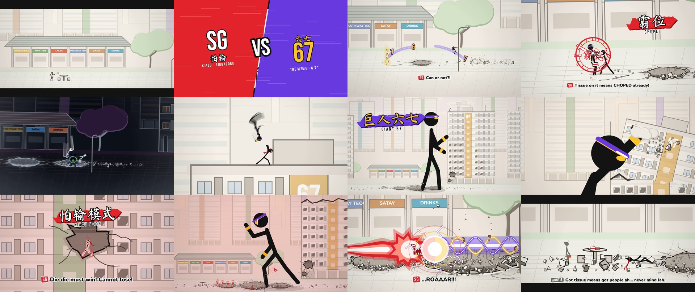

# SG vs 67: a Hyun's Dojo-style stick fight in a Singapore HDB estate

A 92-second 2D stick-figure fight set to an original phonk track. **SG** is the
kiasu Singaporean, with a red headband and long flowing tails. **67** is the
walking "6-7" meme: a head taller (6'7"), a purple headband printed "67", gold
wristbands, and palms that bob up and down. It starts with a tissue packet on a
hawker-centre table and ends with most of the estate in pieces. The dialogue is
in Singlish.



## Watch it

| File | What it is |
|---|---|
| `output/sg-vs-67.mp4` | The finished film: 1920×1080 at 60 fps with motion blur, plus the music and sound effects |
| `dist/sg-vs-67.html` | A single-file interactive player (script and audio inlined, works offline). It draws the animation live in the browser |
| `index.html` | The same player, loading `dist/app.js` and `assets/mix.mp3` |

Player keys: `Space` play/pause, `←`/`→` seek 5 s, `F` fullscreen.

## The story, bar by bar (140 BPM, one bar = 1.714 s)

| Time | What happens | Said |
|---|---|---|
| 0:00 | The camera cranes down from the skyline (with Marina Bay Sands and the Flyer) and HDB blocks to a hawker centre. The music plays on a tinny transistor radio | |
| 0:02 | SG chopes a table: he flicks a tissue packet onto it and gives a thumbs-up | |
| 0:04 | 67 wanders in, ignores the tissue and sits down | 67: *6… 7…* |
| 0:07 | SG comes back with a plate of chicken rice | SG: *Oi! This table I chope already leh!* 67: *6… 7!* SG: *Walao eh… you want to fight is it?!* |
| 0:12 | VS card: **SG** (怕输, kiasu) vs **67** (六七, the meme, 6'7") | |
| 0:13 | **Drop.** Their fists meet in mid-air and the shockwave cracks the plaza. 67's reach (jab, roundhouse, spinning back kick) against SG's slips and flying knee; a heel drop cracks the paving | |
| 0:17 | **SIX-SEVEN SCALES** (六七天秤): every bob of 67's palms fires a golden 6 or 7 in a curving swarm. SG sprints, skids and slides under them | SG: *Can or not?!* |
| 0:20 | **CHOPE!** (霸位): three tissue packets stick to 67 and a 霸位 seal binds him. SG lands a jab-cross flurry, an uppercut and a spinning heel kick, follows him into the air and heel-drops him into a crater | SG: *Tissue on it means CHOPED already!* |
| 0:25 | The seal bursts into tissue confetti. 67 rises glowing gold and conjures a golden basketball, dribbling it on the beat | 67: *SIX… SEVEN.* |
| 0:26 | **DOOT DOOT DUNK** (灌篮): a dunk from 12 m up. The golden blast leaves a crater, blows out the windows of BLK 67 and slams SG into its wall | |
| 0:30 | SG runs straight up the side of BLK 67 while 67 bounds up the corridor parapets | SG: *Okay. Now I angry already.* |
| 0:34 | Rooftop fight against the skyline: slip, cross, block, a caught axe kick, an over-the-shoulder throw, and a spinning back kick that sends 67 off the roof | |
| 0:38 | 67 hits the plaza… and grows | SG: *…Eh? Eh eh eh—* |
| 0:41 | **Break.** GIANT 67 (巨人六七) towers over the block and does the 6-7 at half speed | SG: *Wah lau… so big for what?!* |
| 0:48 | **Drop B.** The giant's punch shears the top floors off BLK 67. SG runs down his arm and flying-knees his jaw, then gets swatted into BLK 68 far behind | |
| 0:53 | Lying in the rubble, SG thinks of his table | SG: *Cannot… lose…* |
| 0:54 | **KIASU MODE** (怕输模式): red aura, blown-out windows. SG launches straight back and punches the giant in the gut | SG: *Die die must win! Cannot lose!* |
| 0:58 | **QUEUE RUSH** (排队冲锋): SG claps, and six clones pop out in a proper queue, numbered #001 to #006. On each beat the next in line strikes, climbing from shin to head, and the giant shrinks with every hit. SG's axe kick finishes it | SG: *Everybody… QUEUE UP!* / *Wait your turn lah!* |
| 1:05 | 67 is back: a fast exchange, the opening fist-clash again, then **SIX-SEVEN SCALES · MAX** rains numerals from the sky. SG kicks a 7 straight back at him | SG: *Here, take back your seven!* |
| 1:12 | Standoff close-ups, with SG between 67 and the table | SG: *This table… I chope already.* 67: *…6. 7.* |
| 1:15 | **LION CITY ROAR** (狮城咆哮, a red beam with a lion's head) against **SIX-SEVEN HELIX** (六七螺旋, a gold and purple double helix full of 6s and 7s). The beams push each other back and forth | SG: *…ROAAAR!!!* |
| 1:22 | The clash explodes | |
| 1:24 | The dust settles. Both lie at the edge of a huge crater. The table, with the chicken rice and the tissue, is untouched. An auntie walks up, adds her own tissue packet and sits down | Auntie: *Got tissue means got people ah… never mind lah.* |
| 1:28 | | SG + 67: *…Walao eh.* 67 (weakly): *6… 7…* |
| 1:31 | End card with a red 完 seal | |

## Skills (designed for this film)

| Skill | Who | What it looks like |
|---|---|---|
| CHOPE! 霸位 | SG | Spinning tissue packets stick to the target; a red seal ring with 霸位 and white talisman strips binds him until it bursts into tissue confetti |
| QUEUE RUSH 排队冲锋 | SG | Red clones with white tails pop in as a numbered queue, and each attacks on its beat |
| KIASU MODE 怕输模式 | SG | Red flame aura with a white core, red lightning, a red-tinted grade and glowing eyes |
| LION CITY ROAR 狮城咆哮 | SG | A layered red and white beam whose front is a roaring lion's head |
| SIX-SEVEN SCALES 六七天秤 | 67 | Each bob of his palms fires a golden numeral in an Itano-circus arc, trailing purple smoke, and each explodes where it lands |
| DOOT DOOT DUNK 灌篮 | 67 | A golden basketball of energy dribbled on the beat, then dunked from the sky: a gold fireball, a shockwave dome and a crater |
| GIANT 67 巨人六七 | 67 | 67 grows about 18× in purple lightning and dust |
| SIX-SEVEN HELIX 六七螺旋 | 67 | A purple beam wrapped in gold and purple helices, with 6s and 7s riding them |

## What makes it smooth this time

The previous film (Iron and Ash) eased every keyframe separately, so motion
stopped at each key, and characters turned by flipping mirror-image instantly.
This film uses a new engine:

- **Spline motion.** Every pose channel is a monotone cubic (PCHIP) spline
  through the keys (`src/track.js`). Velocity is continuous across keys and
  there is no overshoot. Strikes can use an `in` interpolation, which
  accelerates into the contact frame.
- **Real 3D turning.** The rig (`src/rig3.js`) is a 3D skeleton rotated by a
  yaw angle and projected. Turns and spinning kicks rotate through the front
  and back views. Planted feet use 3D two-bone IK.
- **Smooth hit-stops.** Time slows into a near-freeze on a heavy blow, then a
  sine-shaped catch-up repays the lost time, so the choreography stays on
  the beat. Slow motion uses the same mechanism (`makeWarp`).
- **Motion blur.** A 180° shutter at 60 fps (1/120 s). Each frame averages 1
  to 6 sub-frames, depending on how far the fastest limb or the camera moves
  on screen. Blur never crosses a camera cut, and titles are drawn after the
  blur so they stay sharp.
- **Smooth camera.** The camera keys are splines too, and zoom is
  interpolated logarithmically. Shake uses smooth noise. Zoom punches settle
  like a spring.
- **Blows that land.** For every strike, the director checks where the fist
  or foot actually is at the contact time. It then shifts the attacker's nearby
  keys so the blow meets the target (`blow()` in `src/director.js`).

## The estate and its destruction

Everything is drawn in 2.5D parallax layers (`src/camera.js`):

| Layer | Contents |
|---|---|
| Sky | Sun and clouds |
| Skyline | Towers, Marina Bay Sands and the Singapore Flyer |
| Far | A far estate of HDB blocks behind aerial haze |
| Mid | The hawker centre (chicken rice, kopi, laksa, char kway teow, satay, drinks), rain trees and BLKs 68 to 70 |
| Fight plane | The plaza, BLK 67 and the fighters |
| Foreground | Lamp posts |

HDB blocks (`src/city.js`) have void decks, corridors with doors, windows and
railings, a coloured lift core with the block number, and a rooftop tank.

They can be destroyed in three ways:

- **Holes**: a concrete rim, bent rebar and radiating cracks. Fighters can
  crash into far blocks, because an actor's transform blends between the fight
  plane and the mid layer.
- **Blown-out windows**: the shockwave spreads outward, leaving jagged glass
  and falling shards.
- **Collapse**: a sheared top section with a jagged break line topples away,
  followed by dust, debris and glass.

Craters, 3D rock debris and dust come from the previous film's world code.

## Music and sound

`tools/music.py` synthesizes an original drift-phonk track at 140 BPM in A
Phrygian:

- a pitched 808-style cowbell riff
- distorted 808 bass with glides
- a hard kick, claps on 2 and 4, and busy hats with triplet rolls
- risers, snare rolls, impacts and reverse swells
- a dark pad for the giant's half-time break

The kick ducks the bass and bells, sidechain style. The intro and outro play
through a band-passed "hawker radio" with crackle and crowd murmur.
`tools/sfx.py` synthesizes 38 kinds of sound effect. Among them are the tissue
flick, the seal stamp, the "doot" (a brassy synth note plus a ball bounce),
glass, a concrete collapse, the beam hum, a formant-filtered lion roar and the
final explosion. The music ducks under loud effects.

## Research behind it

- The "6-7" meme comes from Skrilla's "Doot Doot (6 7)" and its association
  with LaMelo Ball, who is 6 ft 7 in. The gesture is palms up, moving up and
  down like scales. Hence the numerals, the height, the "doot" and the
  basketball.
- *Kiasu* is Hokkien for "fear of losing". *Chope* means reserving a hawker
  seat with a tissue packet.
- Other Singlish used: *walao eh*, *die die must*, *can or not*, *lah*, *leh*.
- Singapore scenery: HDB void decks, hawker centres, and HDB block numbers on
  the lift core.
- Sakuga technique: arcs and slow-in/slow-out, anticipation and follow-through,
  impact frames, smears, and Itano-circus swarms. The beam fight is a classic
  beam-o-war.
- The 180° shutter rule for 60 fps motion blur.

## Build and render

```bash
npm run sg:sfx      # music.py + story sound events + sfx.py -> assets/mix.mp3
npm run sg:build    # -> dist/app.js and dist/sg-vs-67.html
npm run sg:render   # -> output/sg-vs-67.mp4 (1080p60, needs ffmpeg + Chromium)
node tools/render.mjs --page sgvs67/index.html --song sgvs67/assets/mix.mp3 --duration 92.5 --fps 60 --from 48 --to 52 --out clip.mp4
```

Open `index.html?t=48` to start at a given time, or `?noblur` to draw without
motion blur.

## Credits

Everything is original and procedural: the animation, the characters, the
music and the sound effects. Fonts are Ma Shan Zheng (brush Chinese, a subset),
Bebas Neue and Nunito, all under the SIL Open Font License.
