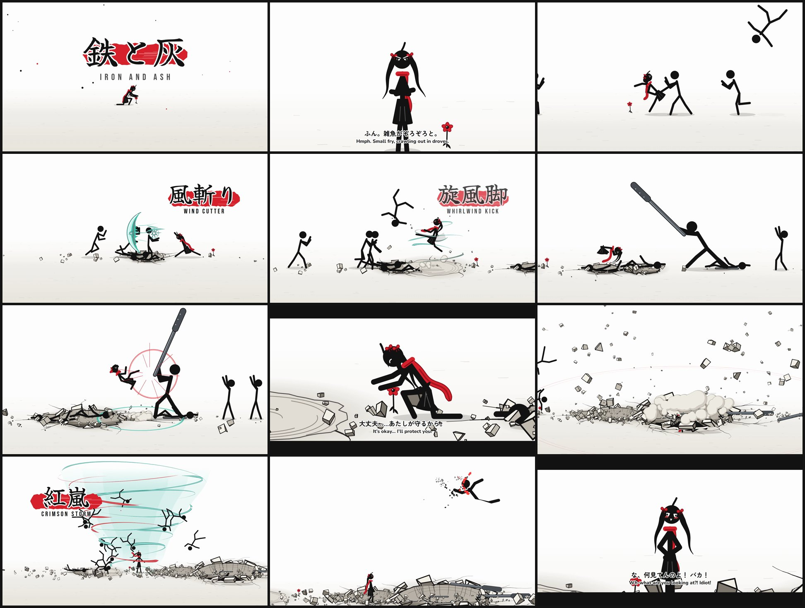

# Iron and Ash (鉄と灰): a Hyun's Dojo-style stick fight

A 110-second 2D stick-figure fight animated to the song *Iron and Ash*
(`assets/iron-and-ash.mp3`). The heroine is a tsundere **anime girl**: black
twin-tails with red ribbons, a red scarf and a pleated skirt. She protects one
small red flower on a white plain from a horde of anonymous stickmen and an
iron-club brute. Her power is **wind** (teal with white cores and thin red
accents, no pink). She speaks Japanese, with English subtitles.



## Watch it

| File | What it is |
|---|---|
| `output/iron-and-ash.mp4` | The finished film, 1920×1080 at 60 fps, with the song and sound effects |
| `dist/iron-and-ash.html` | A single-file interactive player (JavaScript and audio inlined, works offline). It draws the animation live in the browser |
| `index.html` | The same player, loading `dist/app.js` and `assets/mix.mp3` |

Player keys: `Space` play/pause, `←`/`→` seek 5 s, `F` fullscreen.

## The story, beat by beat

The song runs at 110 BPM (beat *k* falls at 0.1799 + 0.5455·*k* s). Every strike,
crater and cut is placed on that grid or on an accent measured from the audio.

| Time | What happens | She says (Japanese, then the English subtitle) |
|---|---|---|
| 0:00 | Brush-kanji title 鉄と灰 stamps in on the first big hit. She kneels by a small red flower while the wind blows | |
| 0:05 | The kick drum enters and the horde walks in from both sides | ……何よ、あんたたち。 (…What do you want, you lot?) |
| 0:09 | Front close-up, arms crossed | ふん。雑魚がぞろぞろと。 (Hmph. Small fry, crawling out in droves.) |
| 0:12 | One of them walks up and raises his foot over the flower | この花、踏んだら……許さないんだから！ (Step on this flower and… I will never forgive you!) |
| 0:15 | On the accent after the quiet bar: a dash and a wind palm strike, with the first impact frame | 言ったでしょ。踏むなって。 (I told you. Don't step on it.) / かかってきなさいよ！ (Come at me, then!) |
| 0:17 | First waves: duck and uppercut, block and side kick, roundhouse, a mid-air kick that leaves a crater, a sweep and a front kick | |
| 0:28 | **風斬り Wind Cutter**: a crescent wind blade cuts through a charging line of three | |
| 0:31 | Parry, jab, cross, roundhouse, sweep, an axe kick that leaves a crater, and a disarm that sends an iron pipe flying | |
| 0:37 | Six more drop from the sky | まだやるの？ しつこいわね！ (Still at it? You're so persistent!) |
| 0:39 | A dash through three of them, a flight back to save the flower, and two kicks in mid-air | |
| 0:47 | **旋風脚 Whirlwind Kick**: a spinning kick inside a vortex flings four away | |
| 0:50 | The brute arrives, dragging an iron club; every step shakes the ground. His smash leaves a crater | |
| 0:56 | His club blocks her kick, he swings and backhands her, and she wipes her cheek | |
| 1:03 | Peak: flying kick against the club (impact frame), she disarms him and the club sticks in the ground, then a combo, a spin kick and four minions | |
| 1:13 | The brute launches a rock at the flower. She dives to shield it | |
| 1:14 | **Breakdown** (slow motion, letterbox): the rock shatters on her back | ……痛いじゃない。 (…That hurt, you know.) |
| 1:17 | Kneeling over the flower | 大丈夫……あたしが守るから。 (It's okay… I'll protect you.) |
| 1:19 | …then she realises what she said and blushes | べ、別にあんたのためじゃないんだからね！ (I-it's not like I'm doing this for you!) |
| 1:20 | Her eyes turn red and a wind burst blows four stickmen away | ……本気で行くわよ。 (…Now I'm getting serious.) |
| 1:21 | A triple hit on the triple kick drum, a hop over his swing, a launcher and an air combo | |
| 1:31 | The strongest accent in the song: a dive kick makes the biggest crater (impact frame, slabs, 110 rocks) | |
| 1:34 | **紅嵐 Crimson Storm**: she stands over the flower in the calm eye of a red and teal tornado that pulls everyone in | |
| 1:37 | On the drop the storm bursts and every stickman crumbles to ash | |
| 1:39 | The brute rises for a last charge; a spinning heel kick (last impact frame) sends him into the sky, where he burns to ash | |
| 1:44 | She walks back and kneels by the flower | ……よかった。 (…Thank goodness.) |
| 1:47 | …and notices you watching | な、何見てんのよ！ バカ！ (Wh-what are you looking at?! Idiot!) |
| 1:48 | A red 完 seal ends the film | |

## Style and the techniques used

**Hyun's Dojo style.** Hyun's Dojo is a stick-figure animation community
founded in 2012 by Eric "Hyun" Kwon, known for "Dojo Duels". Its look is
thick black strokes with round caps, solid round heads and a white
background. The fights are fast and fluid, and the camera pans, zooms and
shakes with the action. This film follows that look and adds a pale floor
that fades into the white background, so craters and rocks can sit on it.

**Anime effects, chosen to be used sparingly** (the brief asked for no
screen-filling speed lines):

- **Impact frames**: negative and red-tinted frames that flash for 3 to 6
  frames. There are only four: the first palm strike, the clash with the club,
  the big crater, and the final blow.
- **Hit-stop**: the scene freezes for 60 to 120 ms at each heavy blow, then
  catches up (`makeWarp` in `src/track.js`). The camera shake keeps running
  during the freeze.
- **Smear frames**: fast limbs leave the area they swept as an ink smear, and
  wind attacks add a teal core to it (`drawSmears` in `src/scene.js`).
- **Yutapon cubes** (after the animator Yutaka Nakamura): the rock debris is
  made of true 3D cuboids and wedges, flat-shaded in three tones with ink
  outlines. They tumble, bounce and come to rest.
- **Craters** have a shaded far wall with fractures, an ink rim, a raised
  near lip and upturned slabs. Cracks spread from the rim, and the craters
  deform the ground that feet and bodies land on.
- **Wind**, in teal and never pink: curl wisps, the Wind Cutter blade (a
  crescent with a torn trailing edge and a red inner line), whirlwind bands
  that pass in front of and behind her, and the Crimson Storm funnel.
- **Speed lines** appear only twice, as a few thin streaks trailing her,
  never across the whole screen.
- **Afterimages** during dashes, a red eye streak once she powers up, and
  cel-shaded dust puffs and dust rings.
- **Ash**: defeated stickmen crumble into flakes. A dissolve front sweeps
  across each body, leaving a brief red ember edge, and the wind carries the
  flakes away.

## How it's made

Plain JavaScript and the Canvas 2D API. The whole film is a **pure function of
song time**, so the live player and the frame-exact renderer run the same code.

| File | Role |
|---|---|
| `src/rig.js` | Stick-figure skeleton: forward kinematics with planted-foot two-bone IK, pose blending, and the Hyun's Dojo stroke style |
| `src/poses.js` | Pose library (stances, strikes, kicks, aerial moves, kneeling and front-view poses for the girl, and enemy poses), plus procedural run, walk, flail and lying poses |
| `src/girl.js` | The heroine's twin-tails, scarf, ahoge and skirt, which trail her past positions (secondary motion), and her face (eyes, red glint, blush) |
| `src/track.js` | Actors and clips: keyframes with run/walk cycles and jump arcs, turns, pre-simulated ragdoll flights with bounces and slides, the storm orbit, and the hit-stop and slow-motion time warp |
| `src/world.js` | The floor, craters, cracks, rock physics, dust, iron props, the wind field and the flower |
| `src/fx.js` | Wind effects, sparks, streaks, impact frames and the ash dissolve |
| `src/director.js` | Story builder: song time to scene time, knock-backs simulated in time order (so bodies land in craters that exist), and camera, dialogue and effect tracks |
| `src/story.js` | The choreography itself. Blows are aligned to her fist or foot, so every hit connects |
| `src/scene.js`, `src/text.js` | Frame composition, subtitles, brush call-outs, the title and the seal |
| `tools/sfx.py` | Procedural sound effects (punches, kicks, whooshes, iron clangs, crater booms, the storm) mixed under the song into `assets/mix.mp3` |

## Build and render

```bash
npm install
npm run fight:sfx      # sound events -> stickfight/assets/mix.mp3 (python3 + numpy/scipy + ffmpeg)
npm run fight:build    # -> stickfight/dist/app.js and stickfight/dist/iron-and-ash.html
npm run fight:render   # -> stickfight/output/iron-and-ash.mp4 (1080p60; needs ffmpeg + Chromium)
node tools/render.mjs --page stickfight/index.html --song stickfight/assets/mix.mp3 \
     --duration 110.2 --fps 60 --from 90 --to 100 --out clip.mp4   # just a clip
```

## Research references

- Hyun's Dojo: [hyunsdojo.com](https://www.hyunsdojo.com/), [Hyun's Dojo on the Stickpage wiki](https://stickpage.fandom.com/wiki/Hyun's_Dojo), [Hyun on the Hyun's Dojo wiki](https://hyunsdojo.fandom.com/wiki/Hyun), [Learning Animation](https://hyunsdojo.fandom.com/wiki/Learning_Animation), [flip-book stick figure basics](https://www.rocketalumnisolutions.com/news/flip-book-stick-figure)
- Impact frames: [Brain Voyage guide](https://brainvoyage.blog/impact-frames-meaning-animation-guide), [Sakugabooru: impact frames](https://www.sakugabooru.com/wiki/show?title=impact_frames)
- Smear frames and afterimages: [CG Wire](https://blog.cg-wire.com/smear-frames/), [Wikipedia](https://en.wikipedia.org/wiki/Smear_frame), [TV Tropes: Speed Echoes](https://tvtropes.org/pmwiki/pmwiki.php/Main/SpeedEchoes)
- Yutapon cubes: [Sakugabooru](https://www.sakugabooru.com/wiki/show?title=yutapon_cubes), [Yutaka Nakamura](https://en.wikipedia.org/wiki/Yutaka_Nakamura)
- Hit-stop: [TV Tropes](https://tvtropes.org/pmwiki/pmwiki.php/Main/HitStop), [Sakurai's Famitsu column on hitstop (Source Gaming)](https://sourcegaming.info/2015/11/11/thoughts-on-hitstop-sakurais-famitsu-column-vol-490-1/)
- Wind effects: [Wind Breathing (Kimetsu no Yaiba wiki)](https://kimetsu-no-yaiba.fandom.com/wiki/Wind_Breathing), [Demon Slayer breathing styles by visual effects](https://www.alibaba.com/product-insights/demon-slayer-breathing-styles-ranked-by-visual-effects-in-the-anime.html), [Slynyrd Pixelblog 33: wind effects](https://www.slynyrd.com/blog/2021/7/16/pixelblog-33-wind-effects)
- Dust, cracks and craters: [FootageCrate anime dust shockwave](https://footagecrate.com/video-effects/FootageCrate-4K_Anime_Dust_Large_Shockwave_1), [ground crack and debris VFX in Spine](https://www.classcentral.com/course/youtube-ground-crack-impact-explosion-debris-rocks-vfx-in-spine-2d-tutorial-133547)

## Credits

- Song: *Iron and Ash* (supplied with the request; made with Suno).
- Fonts (SIL Open Font License): Zen Maru Gothic and Yuji Syuku (Google Fonts, subset to the characters used), Nunito and Bebas Neue (Fontsource).
- The characters, choreography, effects and sound effects were made for this film.
